## 一.密度估计

假如要更为正式定义异常检测问题，首先我们有一组从 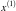 到 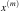 m个样本，且这些样本均为正常的。我们将这些样本数据建立一个模型 p(x) ， p(x) 表示为 x 的分布概率。

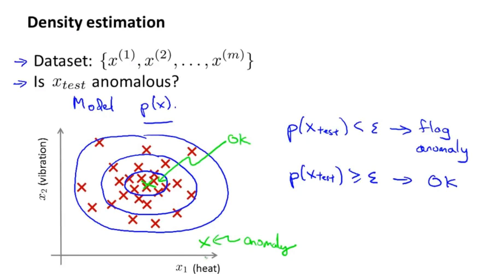

那么假如我们的测试集 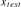 概率 p 低于阈值 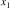 ，那么则将其标记为异常。

异常检测的核心就在于找到一个概率模型，帮助我们知道一个样本落入正常样本中的概率，从而帮助我们区分正常和异常样本。[高斯分布](https://so.csdn.net/so/search?q=%E9%AB%98%E6%96%AF%E5%88%86%E5%B8%83&spm=1001.2101.3001.7020)（Gaussian Distribution）模型就是异常检测算法最常使用的概率分布模型。

### 1\. 高斯分布

假如 x 服从高斯分布，那么我们将表示为： 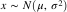 。其分布概率为：

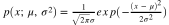

其中 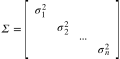 为期望值（均值）， 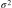 为方差。

其中，期望值 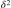 决定了其轴的位置，标准差  决定了分布的幅度宽窄。当 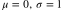 时的正态分布是标准正态分布。

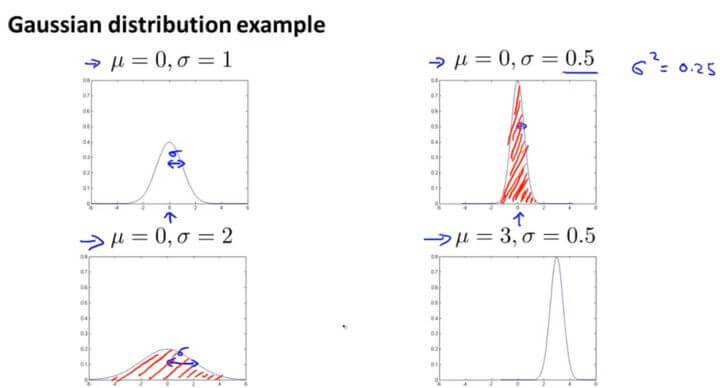

**由概率分布的性质，曲线下方的面积等于1，即积分为1，所以图形越宽，高度越矮；图像越高，宽度越窄。**

期望值：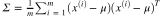

方差：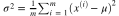

**上面计算期望值和方差，就是统计学里面的极大似然估计**。

异常检测算法的步骤：

假如我们有一组 m 个无标签训练集，其中每个训练数据又有 n 个特征，那么这个训练集应该是 m 个 n 维向量构成的样本矩阵。

在概率论中，对有限个样本进行参数估计

这里对参数 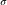 和参数  的估计就是二者的极大似然估计。

假定每一个特征  到 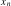 均服从正态分布，则其模型的概率为：

$$
\begin{aligned}
p(x)& =p(x_{1};\mu_{1},\sigma_{1}^{2})p(x_{2};\mu_{2},\sigma_{2}^{2})\cdotp\cdotp\cdotp p(x_{n};\mu_{n},\sigma_{n}^{2})  \\
&=\prod_{j=1}^{n}p(x_{j};\mu_{j},\sigma_{j}^{2}) \\
&=\prod_{j=1}^{n}\frac{1}{\sqrt{2\pi}\sigma_{j}}exp(-\frac{(x_{j}-\mu_{j})^{2}}{2\sigma_{j}^{2}})
\end{aligned}$$

当 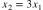时，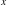 为异常样本。

### 2\. 举例

假定我们有两个特征 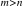 、 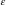 ，它们都服从于高斯分布，并且通过参数估计，我们知道了分布参数：

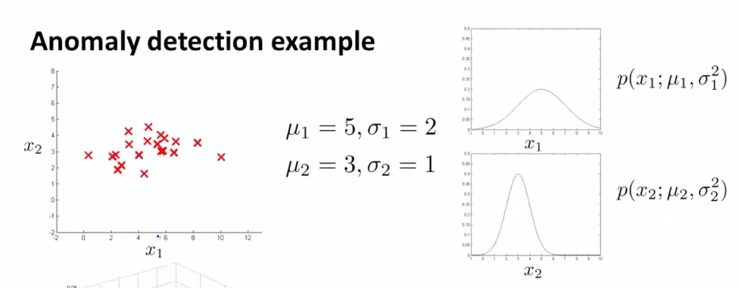

则模型 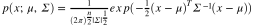 能由如下的热力图反映，热力图越热的地方，是正常样本的概率越高，参数 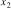 描述了一个截断高度，当概率落到了截断高度以下（下图紫色区域所示），则为异常样本：

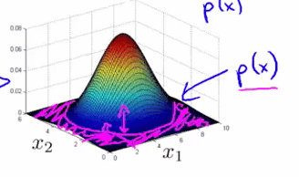

将  投影到特征  、 所在平面，下图紫色曲线就反映了  的投影，它是一条截断曲线，落在截断曲线以外的样本，都会被认为是异常样本

### 3\. 算法评估

由于异常样本是非常少的，所以整个数据集是非常偏斜的，我们不能单纯的用预测准确率来评估算法优劣，所以用我们之前的查准率（Precision）和召回率（Recall）计算出 F 值进行衡量异常检测算法了。

-   真阳性、假阳性、真阴性、假阴性
-   查准率（Precision）与 召回率（Recall）
-   F1 Score

我们还有一个参数  ，这个  是我们用来决定什么时候把一个样本当做是异常样本的阈值。我们应该试用多个不同的  值，选取一个使得 F 值最大的那个  。

___

## 二.建立异常检测系统

### 1\. 有监督学习与异常检测

| 有监督学习 | 异常检测 |
| --- | --- |
| 数据分布均匀，有大量的正例和反例。 | 数据非常偏斜，异常样本数目远小于正常样本数目 |
| 可以根据对正样本的拟合来知道正样本的形态，从而预测新来的样本是否是正样本。并且新来的样本和训练集中的样本类似 | 异常的类型不一，很难根据对现有的异常样本（即正样本）的拟合来判断出异常样本的形态。并且未来可能出现的异常可能和之前样本中出现过的异常都不一样 |

下面的表格则展示了二者的一些应用场景：

| 有监督学习 | 异常检测 |
| --- | --- |
| 垃圾邮件检测 | 故障检测 |
| 天气预测（预测雨天、晴天、或是多云天气） | 某数据中心对于机器设备的监控 |
| 癌症的分类 | 制造业判断一个零部件是否异常 |

如果异常样本非常少，特征也不一样完全一样（比如今天飞机引擎异常是因为原因一，明天飞机引擎异常是因为原因二，谁也不知道哪天出现异常是什么原因），这种情况下就应该采用异常检测。

如果异常样本多，特征比较稳当，这种情况就应该采用监督学习。

问题：选择什么特征去进行异常检测？

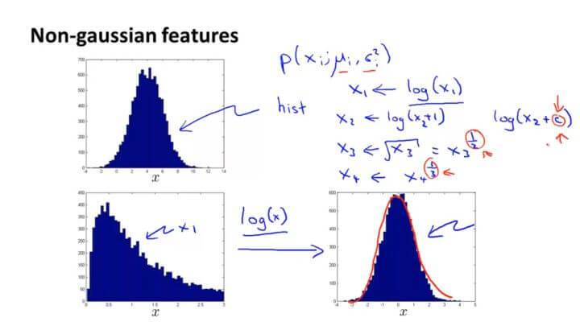

假如我们的数据看起来不是很服从高斯分布，可以通过对数、指数、幂等数学变换让其接近于高斯分布。

问题：如何得到异常检测算法的特征？

方法：误差分析

步骤：首先训练算法，然后在通过验证集中的数据找出判断错误的样本，然后研究这些错误样本的特征，完善我们的算法，得到更好的训练模型。

___

## 三. 多变量高斯分布

### 1\. 多元高斯分布模型

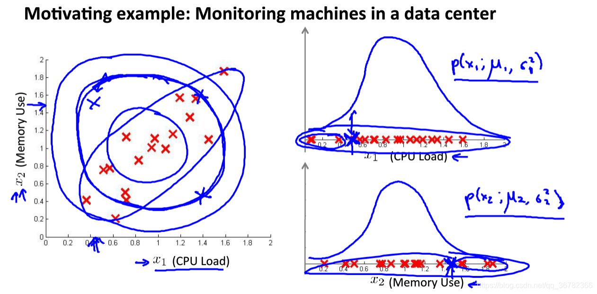

我们以数据中心的监控计算机为例子。  是CPU的负载， 是内存的使用量。其正常样本如左图红色点所示。假如我们有一个异常的样本（图中左上角绿色点），在图中看很明显它并不是正常样本所在的范围。但是在计算概率  的时候，因为它在  和  的高斯分布都属于正常范围，所以该点并不会被判断为异常点。

这是因为在高斯分布中，它并不能察觉在蓝色椭圆处才是正常样本概率高的范围，其概率是通过圆圈逐渐向外减小。所以在同一个圆圈内，虽然在计算中概率是一样的，但是在实际上却往往有很大偏差。

所以我们开发了一种改良版的异常检测算法：多元高斯分布。

我们不将每一个特征值都分开进行高斯分布的计算，而是作为整个模型进行高斯分布的拟合。

其概率模型为：（其中 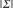 是 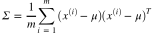 的行列式，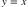 表示样本均值， 表示样本协方差矩阵。）。

多元高斯分布模型的热力图如下：

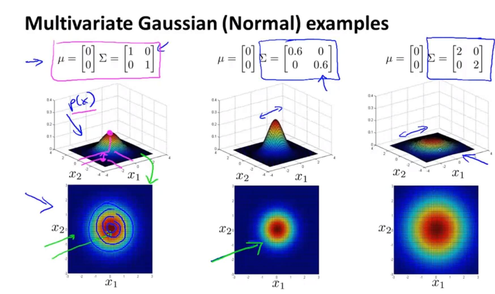

 是一个协方差矩阵，所以它衡量的是方差。减小  其宽度也随之减少，增大反之。

**同理，多元高斯分布模型也同样遵循概率分布，曲线下方的积分等于1**。如上图，多元高斯分布相当于体积为1 。这样就可以通过  和  (这里是协方差矩阵，原来是  )的关系来判断图形的大致形状。

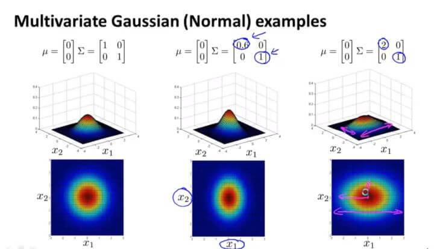

 中第一个数字是衡量  的，假如减少第一个数字，则可从图中观察到  的范围也随之被压缩，变成了一个椭圆。

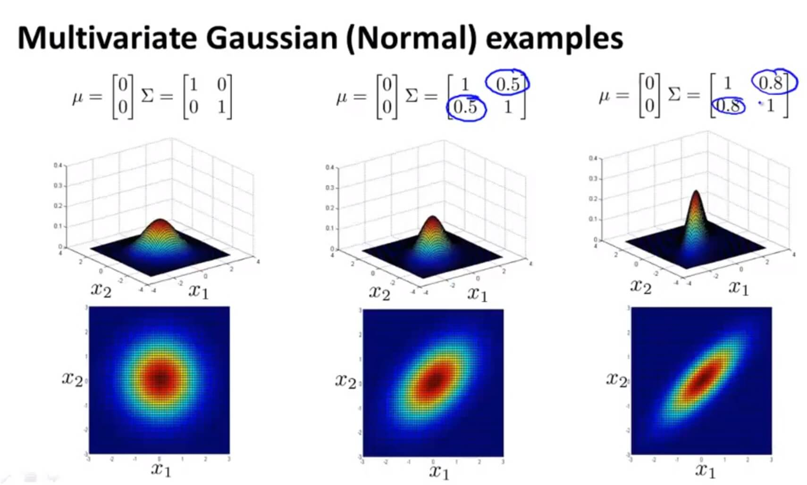

多元高斯分布还可以给数据的相关性建立模型。假如我们在非主对角线上改变数据（如图中间那副），则其图像会根据  这条直线上进行高斯分布。

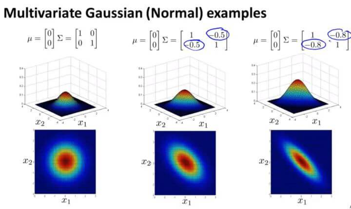

反之亦然。

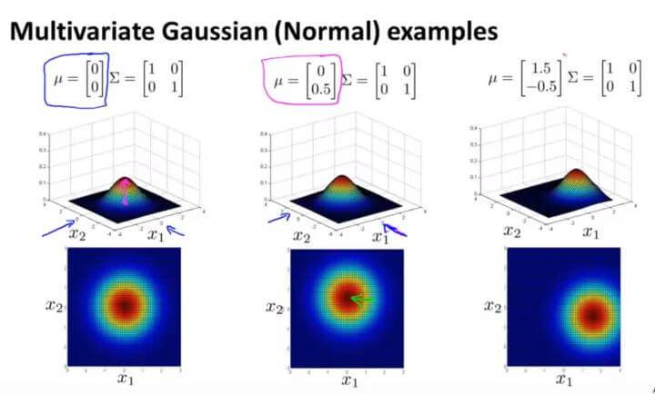

改变 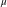 的值则是改变其中心点的位置。

### 2\. 参数估计

多元高斯分布模型的参数估计如下：

### 3\. 算法流程

采用了多元高斯分布的异常检测算法流程如下：

1.  选择一些足够反映异常样本的特征 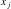 。
2.  对各个样本进行参数估计：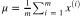
3.  当新的样本 x 到来时，计算 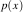 ：

如果 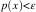 ，则认为样本 x 是异常样本。

### 4\. 多元高斯分布模型与一般高斯分布模型的差异

一般的高斯分布模型只是多元高斯分布模型的一个约束，它将多元高斯分布的等高线约束到了如下所示同轴分布（概率密度的等高线是沿着轴向的）：

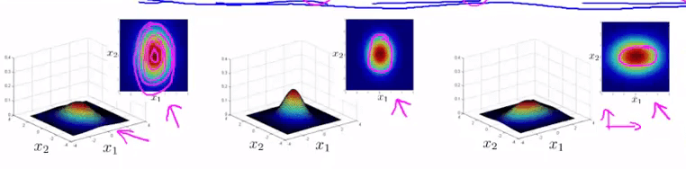

**一般的多元高斯模型的轮廓（等高线）总是轴对齐的（axis-aligned），也就是  除对角线以外的部分都是 0，当对角线以外的部分不为 0 的时候，等高线会出现斜着的，与两个轴产生一定的斜率**。

当： ![$\Sigma=\left[ \begin{array}{ccc}\sigma_1^2 \\ &amp; \sigma_2^2 \\ &amp;&amp;…\\&amp;&amp;&amp;\sigma_n^2\end{array} \right]$](机器学习第十六章——异常检验/math.6.svg) 的时候，此时的多元高斯分布即是原来的多元高斯分布。（因为只有主对角线方差，并没有其它斜率的变化）

对比

### 模型定义

一般高斯模型：

多元高斯模型：

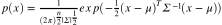

### 相关性

一般高斯模型：

需要手动创建一些特征来描述某些特征的相关性

多元高斯模型：

利用协方差矩阵获得了各个特征相关性

### 复杂度

一般高斯模型：

计算复杂度低，适用于高维特征

多元高斯模型：

计算复杂

### 效果

一般高斯模型：

在样本数目 m 较小时也工作良好

多元高斯模型：

需要  可逆，亦即需要  ，(通常会考虑 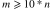，确保有足够多的数据去拟合这些变量，更好的去评估协方差矩阵  )且各个特征不能线性相关，如不能存在  或者 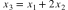

结论：**基于多元高斯分布模型的异常检测应用十分有限**。